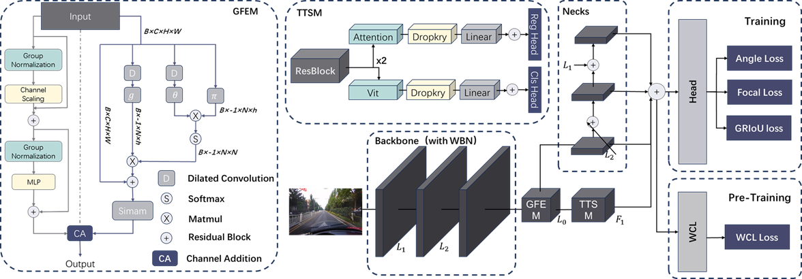
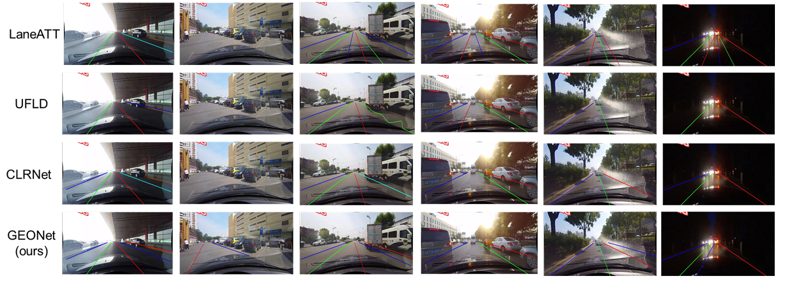

## GEONet: Global Enhancement and Optimization Network for Lane Detection
  

## Abstract
Lane detection plays a crucial role in autonomous driving
systems, enabling vehicles to navigate safely and efficiently
in complex environment. Despite significant advancements
in recent years, accurate lane detection remains a challeng-
ing task, particularly in scenarios with occlusions, ambigu-
ous lane markings, and diverse lighting conditions. In this
paper, we propose the Global Enhancement and Optimiza-
tion Network (GEONet) for lane detection, which is designed
to refine both feature extraction and global feature transmis-
sion. Traditional approaches typically depend on deep convo-
lutional layer stacks for global feature extraction, a process
that often compromises inference speed and the precision of
global feature representation. In contrast, GEONet introduces
a novel and more effective methodology. We present the
Global Feature Extraction Module (GFEM), which is specif-
ically engineered to capture comprehensive global features
with higher accuracy. Additionally, we introduce the Top-
Tier Supplementary Module (TTSM), which enhances these
features through a bottom-up approach, improving overall
lane detection accuracy. To further bolster our framework,
we incorporate Whitening Batch Normalization (WBN) and
Whitening Contrastive Learning (WCL), which enhance fea-
ture robustness and ensure better generalization. In addi-
tion to our novel network design, we propose two new loss
functions to enhance lane detection accuracy. The General-
ized Rectangular Intersection over Union (GRIoU) Loss ex-
tends the predicted points into rectangles, optimizing overlap
and smoothness of lane predictions.The Angle Loss accounts
for angular differences between predicted and ground truth
lanes, improving alignment and continuity. Experimental re-
sults demonstrate that our proposed method significantly out-
performs current state-of-the-art lane detection techniques.

## Visual Comparison with other models
  